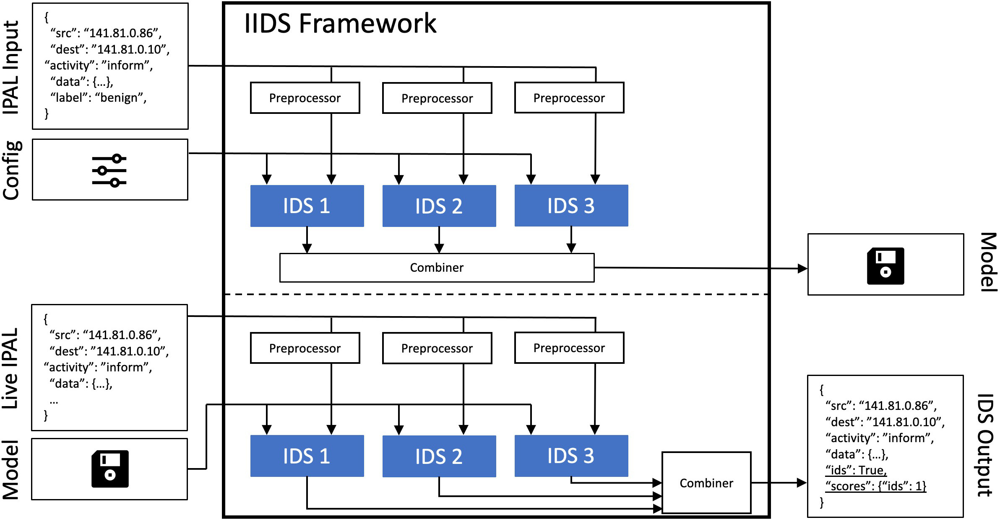

# IPAL - Industrial Intrusion Detection Framework

This repository is part of IPAL - an Industrial Protocol Abstraction Layer. IPAL aims to establish an abstract representation of industrial network traffic for subsequent unified and protocol-independent industrial intrusion detection. IPAL consists of a [transcriber](https://github.com/fkie-cad/ipal_transcriber) to automatically translate industrial traffic into the IPAL representation, an [IDS Framework](https://github.com/fkie-cad/ipal_ids_framework) implementing various industrial intrusion detection systems (IIDSs), and a collection of evaluation [datasets](https://github.com/fkie-cad/ipal_datasets). For details about IPAL, please refer to our publications listed down below.

The ever-increasing digitization in industries enables the automatization of complex physical processes and, with progressive integration into the Internet, also large-scale distributed systems. Due to both trends, well-known cyber-security problems are inherited, which, in the past, already led to severe attacks, e.g., the striking of the Ukrainian power grid in 2015. Supplementing proactive measures, Industrial Intrusion Detection Systems (IIDSs) promise to detect such attacks timely by monitoring the communication between automatization devices or accessing the processes’ physical state. Researchers proposed many IIDS solutions until today. However, due to a lack of standard interfaces and diverse communication protocols across industrial domains, great efforts are required to adapt existing IIDSs to new domains and communication protocols. To overcome this issue, we propose IPAL - a common message format that decouples IIDSs from domain-specific communication protocols. This representation applies to most IIDSs, as all their input data requirements are covered. Moreover, the required data is extractable across multiple industrial protocols due to inherent similarities in their communication patterns.

This repository contains the ``ipal-iids`` framework together with implementations of several IIDSs based on the IPAL message and state format generated by our second project the `ipal-transcriber`. As shown in the overview figure below, the IIDS framework consists of two phases. In the training phase, the IIDSs learn an internal model based on a training dataset and a configuration file with IIDS specific parameters. During the live phase, the IIDSs load the trained models and search for anomalies in live data.

###### Overview Figure



###### Implemented IIDSs

The IIDS framework contains implementations of the following IIDSs. Note that we distinguish between IIDSs operating on the IPAL [message format](https://github.com/fkie-cad/ipal_transcriber#message-format) (on a per-network packet basis) or on the IPAL [state format](https://github.com/fkie-cad/ipal_transcriber#state-format) (a summary of all industrial process values for a given point in time).

| IDSs                   | Type          | Publication/Source Code                                      | Description                                                  |
| ---------------------- | ------------- | ------------------------------------------------------------ | ------------------------------------------------------------ |
| Autoregression         | State         | [Paper](https://doi.org/10.1145/3243734.3243781), [Paper](https://doi.org/10.1145/2664243.2664277), [Code](https://github.com/RhysU/ar) | Process prediction (not reproduced)                                     |
| BLSTM                  | Message/State | [Paper](https://doi.org/10.1109/TrustCom%2FBigDataSE.2018.00094), [Code](https://github.com/Rocionightwater/ML-NIDS-for-SCADA) | Machine Learning - Bidirectional Long Short Term Memory      |
| Decision Trees |Message/State | [Paper](https://dl.acm.org/doi/10.1145/3387940.3391486) [Code](https://zenodo.org/record/3699088) | (not reproduced) |
| Dummy                | Message/State | --                                                           | Implements a Dummy IDS that always or never alerts. |
| DTMC*                   | Message       | [Paper](https://doi.org/10.1007/978-3-319-74947-1_4), [Code](https://github.com/jjchromik/intravis) | Packet Sequences - Discrete-time Markov Chains               |
| Extra Trees |Message/State | [Paper](https://dl.acm.org/doi/10.1145/3387940.3391486) [Code](https://zenodo.org/record/3699088) | (not reproduced) |
| Inter-arrival time     | Message       | [Paper](https://doi.org/10.1007/978-3-319-99843-5_5)         | Packet Inter-arrival time |
| Invariant Rules*       | State         | [Paper](http://dx.doi.org/10.14722/ndss.2019.23265), [Code](https://github.com/cfeng783/NDSS19_InvariantRuleAD) | Compares states against invariant rules generated from training dataset                  |
| Isolation Forest |Message/State | [Paper](https://dl.acm.org/doi/10.1145/3387940.3391486) [Code](https://zenodo.org/record/3699088) | (not reproduced) |
| Naive Bayes    | Message/State | [Paper](https://ieeexplore.ieee.org/stamp/stamp.jsp?tp=&arnumber=7573322) | (not reproduced)
| Optimal                | Message/State | --                                                           | Implements a "Oracle" that always classifies correctly (or always incorrect if desired). |
| PASAD*                  | State         | [Paper](https://doi.org/10.1145/3243734.3243781), [Code](https://github.com/mikeliturbe/pasad), [Code](https://github.com/rahulrajpl/PyPASAD) | Process prediction - Process-Aware Stealthy Attack Detector |
| Random Forest          | Message/State | [Paper](https://doi.org/10.1109/TrustCom%2FBigDataSE.2018.00094), [Code](https://github.com/Rocionightwater/ML-NIDS-for-SCADA) | Machine Learning - Random Forest |
| Seq2SeqNN*              | State         | [Paper](https://doi.org/10.1007/978-3-030-42048-2_1), [Code](https://github.com/jukworks/swat-seq2seq) | Process Prediction - Sequence-to-Sequence Neural Networks    |
| SIMPLE-Histogram              | Message/State | [Paper](https://doi.org/10.1007/978-3-031-17143-7_28)                                                           | Histogramm of a sensor over time.                            |
| SIMPLE-MinMax                 | Message/State | [Paper](https://doi.org/10.1007/978-3-031-17143-7_28)                                                           | Minimum and Maximum of a value plus threshold                |
| SIMPLE-Steadytime              | Message/State | [Paper](https://doi.org/10.1007/978-3-031-17143-7_28)                                                           | Compares longest or shortest time in a single state of a sensor.  |
| Support Vector Machine | Message/State | [Paper](https://doi.org/10.1109/TrustCom%2FBigDataSE.2018.00094), [Code](https://github.com/Rocionightwater/ML-NIDS-for-SCADA) | Machine Learning - Support Vector Machine                    |
| TABOR*                  | State         | [Paper](https://doi.org/10.1145/3196494.3196546)             | Process Sequences - Time Automata and Bayesian netwORk |
Note: IDSs marked with * are not available publically, but can be obtained on request.

###### Publications

- Konrad Wolsing, Eric Wagner, Antoine Saillard, and Martin Henze. 2022. IPAL: Breaking up Silos of Protocol-dependent and Domain-specific Industrial Intrusion Detection Systems. In 25th International Symposium on Research in Attacks, Intrusions and Defenses (RAID 2022), October 26–28, 2022, Limassol, Cyprus. ACM, New York, NY, USA, 17 pages. [https://doi.org/10.1145/3545948.3545968 ](https://doi.org/10.1145/3545948.3545968)
- Wolsing, Konrad, Eric Wagner, and Martin Henze. "Poster: Facilitating Protocol-independent Industrial Intrusion Detection Systems." *Proceedings of the 2020 ACM SIGSAC Conference on Computer and Communications Security*. 2020 [https://doi.org/10.1145/3372297.3420019](https://doi.org/10.1145/3372297.3420019)

## Getting started

###### Prerequisites

- `ipal-iids` requires `libgsl` (or `libgsl-dev`) to be installed. See https://www.gnu.org/software/gsl/doc/html/index.html for further information.
- The Autoregression IIDS requires `ar`. Please make sure that `python-dev` or the corresponding version (e.g. `python3.9-dev`) is installed on your system

###### Installation (pip)

Use `python3 -m pip install .` to install the scripts and dependencies system-wide using the `pip` [python package installer](https://pip.pypa.io/en/stable/installation/). This will install dependencies and the `iids` modules to the local site packages and add the `ipal-iids`, `ipal-visualize-model` and `ipal-extend-alarms` scripts to the `PATH`. The scripts can then be invoked system-wide (e.g. `ipal-iids -h`).

###### Installation (venv)

Alternatively, the project's dependencies can be installed locally in a virtual environment using the `misc/install.sh` script or manually with:

```bash
python3 -m venv venv
source venv/bin/activate

python3 -m pip install numpy
python3 -m pip install -r requirements.txt
```

The scripts can then be invoked after activating the virtual environment from the root of the project repository, e.g.:

```bash
source venv/bin/activate
./ipal-evaluate -h
deactivate
```

###### Installation (docker)

Use `docker build -t ipal-ids-framework:latest .` to build a Docker image with a `pip` installation of the project and development dependencies. The scripts can then be used within containers using the built image, e.g.:

```bash
docker run -it ipal-ids-framework:latest /bin/bash
ipal-ids -h
```

## Usage

#### Usage IIDS Framework

The `ipal-iids` consists of two phases. During training, the parameters `--train.ipal` or `--train.state` have to be provided together with a configuration file via `--config`. Afterwards, the live detection phase starts. Therefore, the parameters `--live.ipal` or `--live.state` have to be provided and `--output` defines the location where the annotated IIDS output is written to.

Each IIDS has its own options which can be retrieved by ```ipal-iids --default.config [ids-name]```.

```bash
ipal-iids -h
usage: ipal-iids [-h] [--train.ipal FILE] [--train.state FILE] [--live.ipal FILE]
                  [--live.state FILE] [--output FILE] [--config FILE] [--default.config IDS]
                  [--retrain] [--log STR] [--logfile FILE] [--compresslevel INT]

optional arguments:
  -h, --help            show this help message and exit
  --train.ipal FILE     input file of IPAL messages to train the IDS on ('-' stdin, '*.gz'
                        compressed).
  --train.state FILE    input file of IPAL state messages to train the IDS on ('-' stdin,
                        '*.gz' compressed).
  --live.ipal FILE      input file of IPAL messages to perform the live detection on ('-'
                        stdin, '*.gz' compressed).
  --live.state FILE     input file of IPAL state messages to perform the live detection on 
                        ('-' stdin, '*.gz' compressed).
  --output FILE         output file to write the anotated IDS output to (Default:none, '-'
                        stdout, '*,gz' compress).
  --config FILE         load IDS configuration and parameters from the specified file
                        ('*.gz' compressed).
  --default.config IDS  dump the default configuration for the specified IDS to stdout and
                        exit, can be used as a basis for writing IDS config files. Available
                        IIDSs are: BLSTM,inter-arrival-mean,inter-arrival-
                        range,RandomForest,SVM
  --retrain             retrain regardless of a trained model file being present.
  --log STR             define logging level (DEBUG, INFO, WARNING, ERROR, CRITICAL)
                        (Default: WARNING).
  --logfile FILE        file to log to (Default: stderr).
  --compresslevel INT   set the gzip compress level. 0 no compress, 1 fast/large, ..., 9
                        slow/tiny. (Default: 9)
```

#### Usage configuration files

The configuration file determines the parameters for each IIDS. A default configuration for each IIDS can be obtained with `ipal-iids --default.config [IIDS name]`:

```bash
ipal-iids --default.config inter-arrival-mean
{
    "inter-arrival-mean": {
        "_type": "inter-arrival-mean",
        "model-file": "./model",
        "N": 4,
        "W": 5
    }
}
```

The IIDS framework allows for using multiple IIDSs in parallel. Each entry in the configuration file can have a different name, e.g., one IIDS for each sensor of a physical system. Currently, the output of multiple IIDSs is combined with 'or' - meaning an alert is emitted if at least one IIDS detected an anomaly.

#### Usage Combiner

If multiple IIDSs are used in parallel, it is possible to specifcy a combiner that fuses the results of the individual approaches into a unified alert. Therefore different strategies can be used as listed in the following table:

| Combiner  | Description                                                  |
| ------------- | ------------------------------------------------------------ |
| All     | Alerts if all IDSs emit an alert.   |
| Any     | Alerts if any IDS emits an alert.   |
| Gurobi     | Solves an optimization problem with Gurobi to find optimal weights for IDSs. This combiner may require a Gurobi license.  |
| Heuristic     | This combiner implements a heuristic that minimizes the number of misclassifications, which maximizes accuracy.   |
| LogisticRegression     | Learns a logistic regression combiner.   |
| Majority     | Alerts if the majority of IDSs emit an alert.   |
| SVM     | Learns a SVM combiner.   |
| Weights     | Each IDS gets assigned a dedicated weight. The combiner alerts if a weighted sum of alerts/scores is greater than a threshold.   |

To utilize a combiner, the IIDS framework requires a dedicated configuration file. A default configuration for each combiner can be obtained with `ipal-iids --combiner.default.config [Combiner name]`:

```bash
ipal-iids --combiner.default.config Weights
{
    "_type": "Weights",
    "model-file": null,
    "weights": {},
    "threshold": 1,
    "use_scores": false
}
```

This configuration file must be provided in addition to the regular IIDS configuration file. An exemplary command would be:

```bash
ipal-iids \
  --config [IDS config file] --train.state [IDS training file] \
  --combiner.config [combiner config file] --train.combiner [Combiner training file] \
  --live.state [live file] --output [output file]
```

Note that some combiners require dedicated training files. It is recommended to use a separate training file for the combiner.

#### Usage Preprocessor

The preprocessors are useful for IIDSs, that require a certain input format. E.g., some machine-learning IIDSs work best if their data is scaled between 0 and 1. Only IIDSs inheriting from the `FeatureIDS` can use the preprocessors. Initially, the preprocessors are fitted to the training data. Currently, the following preprocessors are implemented:

| Preprocessor  | Description                                                  |
| ------------- | ------------------------------------------------------------ |
| aggregate     | Aggregates multiple feature vectors into a single vector     |
| categorical   | Encode, usually strings, as an array of binary indicators    |
| gradient      | Calculates the derivative of a process value                 |
| indicate-none | Extend each feature with a binary value indicating whether the feature is none or not |
| label         | Encode, usually strings, as numeric labels                   |
| mean          | Subtract mean and scale by the standard deviation            |
| minmax        | Scale by minimum and maximum from 0 to 1                     |
| pca           | Performs a principal component analysis on the input vector |

Multiple preprocessors can be used in series. The following example shows how preprocessors are defined in the configuration file:

```json
{
    "SVM Preprocessor Example" : {
        "_type": "SVM",
        ...
        "features" : ["src", "type", "state;4:PID Setpoint", "length"],
        "preprocessors": [
            {"method" : "mean", "features" : ["state;4:PID Setpoint", "length"]},
            {"method" : "categorical", "features" : ["type"]}
        ],
        ...
    }
}
```

#### Usage `ipal-visualize-model`

This tool allows for visualizing the trained models for an IIDS configuration. To plot a specific model use `ipal-visualize-model [path-to-config-file]`.

```bash
ipal-visualize-model  -h
usage: ipal-visualize-model [-h] [--log STR] [--logfile FILE] FILE

positional arguments:
  FILE            load the IDS configuration of the trained model ('*.gz' compressed).

optional arguments:
  -h, --help      show this help message and exit
  --log STR       define logging level (DEBUG, INFO, WARNING, ERROR, CRITICAL).
                  Default is WARNING.
  --logfile FILE  File to log to. Default is stderr.
```

#### Usage `ipal-extend-alarms`

The `ipal-iids` tool works as an online tool - meaning IIDSs have to decide whether they emit an alert live. Therefore, alerts can not be emitted retroactively, wich is sometimes needed for evaluation. As few IIDSs possibly need to retroactively emit alerts, the `ipal-extend-alarms` script post-processes the IIDS output afterward. IIDSs with the support for `ipal-extend-alarms` need the parameter `adjust: true` to be set in their configuration files.

Note that the `ipal-extend-alarms` tool does not implement combiners and simply combines the results with OR.

## Development

##### Tooling

The set of tools used for development, code formatting, style checking, and testing can be installed with the following command:

```bash
python3 -m pip install -r requirements-dev.txt
```

All tools can be executed manually with the following commands and report errors if encountered:

```bash
black .
flake8
python3 -m pytest
```

A `black` and `flake8` check of modified files before any commit can also be forced using Git's pre-commit hook functionality:

```bash
pre-commit install
```

More information on the black and flake8 setup can be found at https://ljvmiranda921.github.io/notebook/2018/06/21/precommits-using-black-and-flake8/

##### Add an IIDS

The process for adding support for a new IIDS is the following:

1. Add a new folder and IIDS module in `ids/[ids name]/[ids name].py `
2. Create a new IIDS class inheriting the MetaIDS class (see ```ids/ids.py```) or inheriting the FeatureIDS class (see `ipial_iids/ids/featureids.py`) for preprocessor support. The IIDS class may implement:
   - `train`: given some training data, the IIDS should learn its internal model
   - `new_ipal_msg`: given a new IPAL message, return whether the IIDS detected an anomaly
   - `new_state_msg`: given a new IPAL state message, return whether the IIDS detected an anomaly
   - `save_trained_model`: save the trained model to disc
   - `load_trained_model`: load a trained model from disc
   - `visualize_model`: create a Matplotlib visualization of the model for debugging purposes
3. Add the new IIDS to the list in ```ids/utils.py```
4. Add the new IIDS to the list in ```tests/conftest.py```
5. Add the new IIDS to the [implemented IIDSs](#implemented-iidss) table above

##### Add a preprocessor

The process for adding a new state extraction method is the following:

1. Add a new preprocessor module in ```preprocessors/```
2. Create a new preprocessor class inheriting the Preprocessor class (see ```preprocessors/preprocessor.py```). The preprocessor class may implement:
   - `fit`: given a set of training data, train the preprocessor on it
   - `transform`: preprocess a given data sample based on the fitted model
   - `reset`: reset the preprocessor between individual dataset
   - `get_fitted_model`: return a representation of the fitted mode, which can be saved to disc
   - `from_fitted_model`: return an initialized preprocessor based on a previously saved model
3. Add the new preprocessor to the list in ```preprocessors/utils.py```
4. Add the new preprocessor to the [preprocessor list](#usage-preprocessor) table above


##### Add a combiner

Adding a combiner is analog to adding a new preprocessor.

## Contributors

- Antoine Saillard (RWTH Aachen University & Fraunhofer FKIE)
- Eric Wagner (Fraunhofer FKIE & RWTH Aachen University)
- Konrad Wolsing (Fraunhofer FKIE & RWTH Aachen University)
- Lea Thiemt (RWTH Aachen University)
- Sven Zemanek (Fraunhofer FKIE)
- Dominik Kus (RWTH Aachen University)
- Frederik Basels (RWTH Aachen University)

## License

MIT License. See LICENSE for details.
